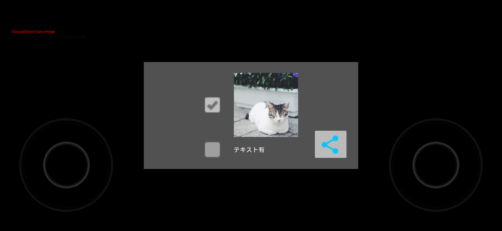
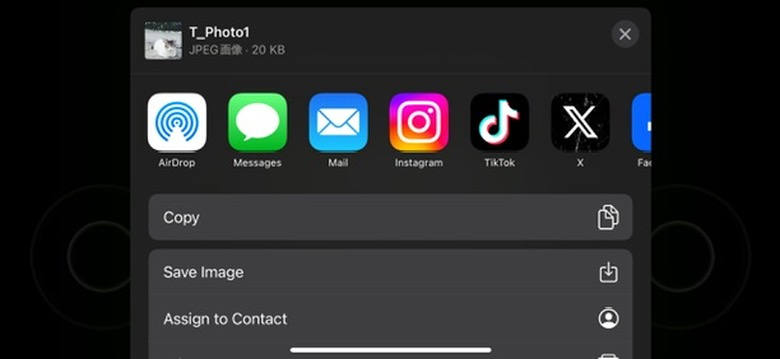

# README

## What's this

「[**fantom-social-share-plugin**](https://github.com/fantom-world/fantom-social-share-plugin)」のお試しサンプルプロジェクトです。（Mobileでテキストや特定の画像をSNS共有するためのプラグイン）

共有する項目（画像、テキスト）にチェックを入れてボタンを押下することでOSの機能を呼び出し共有することができます。

C++、BPの両方について実装例を用意しています。

## 動作環境
UE5.3 ~ 5.4

## 使用方法
1. チェックボックスをタッチして共有する項目を選択
    - テキストのみ
        - 以下のテキストが共有される
            - Title（Androidのみ）：　テキストを共有
            - Subject（Androidのみ）：Favorite Space
            - Message：
            好きで、つながろう
            https://play.google.com/store/apps/details?id=com.sony.snspace
            #FavoriteSpace
    - 画像のみ
        - 表示されているテクスチャがjpg形式で共有される
    - テキストと画像
        - 上記2項目が共有される
2. 画面右下のシェアボタンを押下する
3. OSの共有機能用のUIが表示され、任意の機能を選択することで選択した内容を共有できる
4. 共有終了またはキャンセル時、選択したアクションまたはアプリ名が左上に出力される

## 実装例
以下のファイルを参照
- C++
    - SocialShareSample\Source\SocialShareSample\MainWidgetBase.h
    - SocialShareSample\Source\SocialShareSample\MainWidgetBase.cpp
- BP
    - SocialShareSample\Content\UI\WBP_MainWidget.uasset

## Contact

Yuka Endo (Yuka.Endo@sony.com)